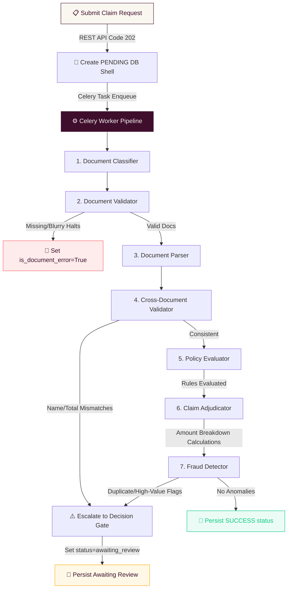

# System Architecture — Plum Claims Orchestration Platform

This document describes the final technical architecture, asynchronous multi-agent orchestration pipeline, human-in-the-loop decision gate, database schemas, and scalability roadmap for the Plum Claims Processing System.

---

## 🏛️ Core System Architecture

The system is built as a fully decoupled, async-first application consisting of a **Next.js frontend** and a **FastAPI backend** utilizing **Celery + Redis** for background task offloading and distributed concurrency guards.

```
                  ┌────────────────────────────────────────┐
                  │            Next.js Frontend            │
                  │            (Port 3000 / UI)            │
                  └───────┬────────────────────────▲───────┘
                          │                        │
             POST /claims │ (REST API)             │ GET /claims/[id] (2s Poll)
             (Idempotency)│                        │ (Awaiting Review status)
                          ▼                        │
                  ┌────────────────────────────────┴───────┐
                  │            FastAPI Backend             │
                  │              (Port 8000)               │
                  └───────┬────────────────────────┬───────┘
                          │                        │
         Enqueue Celery   │                        │ SQLAlchemy Async
         Task with        │                        │ (PostgreSQL/Supabase)
         Local File Path  ▼                        ▼
                  ┌──────────────┐         ┌──────────────┐
                  │ Redis Broker │         │  Postgres DB │
                  │  & Locks     │         │  (Port 5432) │
                  └───────┬──────┘         └───────▲──────┘
                          │                        │
                          │ Celery Workers         │ Transaction Pool
                          ▼                        │ (asyncpg)
                  ┌────────────────────────────────┴───────┐
                  │            Celery Worker               │
                  │         (7-Agent Pipeline)             │
                  └────────────────────────────────────────┘
```

---

## 🔄 Multi-Agent Orchestration Pipeline

Adjudication logic is structured as a **7-Agent sequential execution pipeline** coordinated by the `PipelineExecutor`. 



### 1. State Context (`ClaimContext`)
The pipeline utilizes an in-memory, thread-safe context object `ClaimContext` that is passed sequentially through each agent.
*   **State Aggregation**: Collects classification outputs, OCR-extracted fields, rules checklist results, and individual agent execution latencies.
*   **Overall Confidence Tracker**: Tracks a composite confidence score. This score is reduced whenever non-critical agent tasks degrade, when documents have poor quality, or when fraud indicators are flagged.
*   **Disposal & Loop Resilience**: The context is instantiated once per Celery task run. The Celery worker handles loop cleanups by calling `close_db()` in a `finally` block to dispose of ORM session factories, preventing event loop mismatch errors.

### 2. Early-Exit & Resilience Rules
*   **Early Exit**: If required document validation checks fail (e.g. missing files in Agent 2), execution halts immediately to prevent downstream errors.
*   **Graceful Degradation**: If non-critical agents fail (such as Agent 3 OCR parsing in TC011), the pipeline catches the exception, registers the component as `degraded`, drops the confidence score by `0.3`, and proceeds with alternative heuristics (e.g., using fallback inputs or flagging for `MANUAL_REVIEW`).

---

## 🤖 The 7-Agent Contracts

Every agent implements a common interface `BaseAgent` exposing a clean execution signature:

```python
class BaseAgent(ABC):
    @property
    @abstractmethod
    def agent_name(self) -> str: ...

    @property
    @abstractmethod
    def agent_type(self) -> str: ...

    async def execute(self, context: ClaimContext) -> AgentTraceEntry: ...
```

### Execution Details:
1. **Document Classifier**: Uses vision LLMs (or sandbox configurations) to assign categories (`PRESCRIPTION`, `HOSPITAL_BILL`, etc.) and rate readability (`GOOD`, `POOR`, `UNREADABLE`).
2. **Document Validator**: Evaluates presence of mandatory and optional documents loaded dynamically from `policy_terms.json`.
3. **Document Parser**: Runs OCR to extract patient details, treatment dates, diagnosis, and itemized billing line items.
4. **Cross-Document Validator**: Asserts patient name consistency (using SequenceMatcher fuzzy ratio $\ge 0.75$), dates alignment, hospital matches, category procedure checks, and claimed-amount vs bill-totals alignment.
5. **Policy Evaluator**: Verifies waiting periods (initial and condition-specific maps), annual/per-claim limits, dependency relationship, generic pharmaceutical compliance, alternative medicine registrations, and dental report configurations.
6. **Claim Adjudicator**: Performs decimal math computations:
   - **Discount**: Applied first on network hospital matches.
   - **Co-pay**: Applied after network discount.
   - **Sub-limit**: Caps the remaining value.
7. **Fraud Detector**: Runs rate-limiting checks (same-day/monthly limits), duplicate claim checks (identical date + amount for same member, ignoring current claim ID and rejected outcomes), and high-value overrides.

---

## 💾 Database Schemas

We use **SQLAlchemy Async** mapped onto a PostgreSQL database (local Docker or Supabase Cloud).

### `claims` table:
*   `id` (UUID, Primary Key): Unique claim ID.
*   `member_id`, `member_name`, `policy_id`, `claim_category` (VARCHAR).
*   `status` (VARCHAR): `pending` | `processing` | `awaiting_review` | `completed` | `failed`.
*   `decision` (VARCHAR): `APPROVED` | `PARTIAL` | `REJECTED` | `MANUAL_REVIEW`.
*   `claimed_amount`, `approved_amount` (NUMERIC(12,2)): Fixed-point decimals.
*   `confidence_score` (FLOAT).
*   `is_document_error` (BOOLEAN).
*   `rejection_reasons`, `decision_reasons`, `document_issues`, `fraud_signals`, `degraded_components` (JSONB / Array).
*   `amount_breakdown` (JSONB): Invoice receipt breakdown.
*   `execution_trace` (JSONB): Direct serialization of the 7-Agent execution details.
*   **Decision Gate Columns**:
    - `review_action` (VARCHAR): `approved` | `denied` | NULL.
    - `reviewed_by` (VARCHAR): Auditor name.
    - `reviewed_at` (TIMESTAMP): Auditor timestamp.
    - `review_notes` (VARCHAR): Mandatory notes.
    - `pre_review_decision` (VARCHAR): Stashed pipeline decision.
    - `pre_review_approved_amount` (NUMERIC(12,2)): Stashed pipeline calculation.

---

## ⚡ Concurrency, Idempotency & Celery Optimization

### 1. Distributed Locking (Redis Guard)
To prevent race conditions (consecutive requests double-submitting and bypassing YTD/frequency checks), the background worker acquires a Redis lock before executing the pipeline:
- **Lock Key**: `claim_lock:{member_id}:{treatment_date}:{claim_category}`
- **Timeout**: `120s`, blocking timeout: `5s`.
- If the lock is held, the claim is rejected as a concurrent submission.

### 2. API-Level Idempotency (`X-Idempotency-Key` Header)
To enable safe retries from the frontend, the claims route intercepts `X-Idempotency-Key`:
- Checks Redis for `idempotency:{key}`.
- If present, returns the existing processed or pending claim record immediately.
- If absent, registers the key in Redis with a 24-hour expiration (`ex=86400`) and begins processing.

### 3. Celery Payload Optimization (Disk Storage)
Standard Redis message brokers degrade when handling megabytes of base64-encoded file data.
- **Route Interception**: The FastAPI route writes incoming document byte data to `uploads/{claim_id}/{file_id}_{file_name}`.
- **Offloading**: Clears the heavy `base64_data` block, replacing it with a light `file_path` reference in the dictionary payload. This reduces Redis task payload size from megabytes to under 10KB.
- **Worker Reloading**: The background worker reads the file from disk and re-injects the base64 bytes dynamically before executing OCR tasks.

---

## 🚪 Decision Gate — Human Intervention System

When the pipeline recommends `MANUAL_REVIEW` (due to cross-validation failures, policy warnings, or fraud signals), the claim is placed in the **Decision Gate queue**.

```
  ┌────────────────────────────────────────────────────────┐
  │         Pipeline Recommends MANUAL_REVIEW              │
  │   (Pre-review decision & approved amount stashed)       │
  └──────────────────────────┬─────────────────────────────┘
                             │
                             ▼
  ┌────────────────────────────────────────────────────────┐
  │         Claim Saved Status = AWAITING_REVIEW           │
  │            Active Approved Payout = 0.0                │
  └──────────────────────────┬─────────────────────────────┘
                             │
                             ▼
  ┌────────────────────────────────────────────────────────┐
  │            Auditor Accesses Review Queue               │
  │        Inspects Extracted Data & Fraud Signals         │
  └──────────────────────────┬─────────────────────────────┘
                             │
                 ┌───────────┴───────────┐
                 │                       │
                 ▼                       ▼
      [Action: APPROVE]           [Action: DENY]
      - Input override amount     - Set Decision = REJECTED
      - Mandate Notes             - Payout set to 0.0
      - Restore decision          - Mandate Notes
                 │                       │
                 └───────────┬───────────┘
                             │
                             ▼
  ┌────────────────────────────────────────────────────────┐
  │             Status Updated = COMPLETED                 │
  │             Auditor Stamps Recorded in DB              │
  └────────────────────────────────────────────────────────┘
```

1. **Calculations Capping**: The original calculated payout is preserved in `pre_review_approved_amount` and the decision is saved in `pre_review_decision`. The active `approved_amount` is set to `0.0`.
2. **Review Actions**:
   - **Approve**: Restores the pipeline decision. The auditor can override the approved amount (capped at the claimed amount).
   - **Deny**: Sets the decision to `REJECTED` with an approved amount of `0.0`.
3. **Auditing**: Recording `reviewed_by` and `review_notes` is strictly enforced.

---

## 🚀 10x & 100x Scale Roadmap

To scale the platform to process **10x to 100x load (up to 7.5 million claims annually)**, we recommend the following evolutionary changes:

### 1. Horizontal Worker Auto-Scaling
*   **Stateless Workers**: Celery workers are fully stateless and containerized. They can be scaled horizontally on Kubernetes (EKS/GKE) using Horizontal Pod Autoscalers (HPA) triggered by CPU/Memory or custom metrics like Redis queue length.

### 2. Multi-Node Distributed Locking (`Redlock`)
*   **Current Lock**: A single-node Redis lock.
*   **Target State**: Upgrade to the `Redlock` algorithm using a cluster of Redis nodes (e.g. AWS ElastiCache Redis Cluster) to ensure lock reliability even in the event of primary node failure.

### 3. Read/Write Split & DB Pooling
*   **Database Scaling**: Read-heavy queries (registry viewing, review lists) can be routed to database read replicas.
*   **Write Paths**: Core write paths (pipeline updates) continue targeting primary database nodes. Connect via PgBouncer to manage high pooling volumes.

### 4. Distributed Object Storage
*   **Current File Path**: Relies on local filesystem shares.
*   **Target State**: Re-route uploaded documents to an object store like AWS S3 or Google Cloud Storage (GCS). Store unsigned, short-lived secure URLs in the database payload, allowing distributed worker pods across multiple servers to download scans directly from the cloud bucket.

### 5. Policy Terms & Roster Caching
*   **Cache Store**: Cache the member roster and policy configuration rules inside Redis.
*   **Invalidation**: Setup webhook invalidators so changes to policy rules or member registrations instantly update the Redis cache, avoiding database lookups during pipeline execution.
